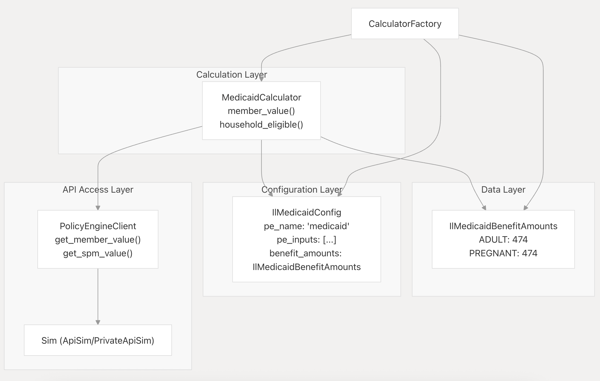

# RFC 0003: Program Calculator Architecture Refactor

Status: Draft
Author: [Your Name]
Created: 2025-10-14
PR: [TBD]

## Summary

This RFC proposes a fundamental restructuring of the Program calculator architecture to eliminate deep inheritance chains and mixed concerns. 

The current implementation couples benefit amounts, PolicyEngine/Program configuration, and calculation logic within deeply nested class hierarchies (up to 5 levels), making state variations difficult to add and the codebase nearly impossible to test. 

By introducing a composition-based architecture with five distinct components—PolicyEngineClient for API access, data classes for benefit amounts, a config registry for dependencies, pure calculator logic, and a factory pattern for instantiation—we can reduce calculator inheritance to just 2 levels while enabling state-specific variations through simple data and configuration changes rather than new calculator classes.

## Background

The current Program calculator architecture is organized by state, with each state having its own directory containing both PolicyEngine and custom calculators. This introduces several problems:

### Current Architecture Problems

**Deep Inheritance Chains**: The system uses up to 5 levels of inheritance:
- `ProgramCalculator` → `PolicyEngineCalulator` → `PolicyEngineMembersCalculator` → `Medicaid` → `IlMedicaid`

**Mixed Concerns**: The `CoMedicaid` class (and similar state calculators) mixes:
- Data (benefit amounts)
- Configuration (PE variables, dependencies)
- Logic (calculation methods)
- API access (inherited through base classes)

**Difficult to Test**: Without proper separation of concerns, adding comprehensive test coverage would require complex mocking of deeply nested inheritance chains and live API calls. The codebase currently has no testing infrastructure, and the current architecture makes it nearly impossible to add.

**State Variations Are Expensive**: Adding a new state (e.g., Texas Medicaid) currently requires:
1. Creating `programs/programs/tx/pe/member.py`
2. Defining `class TxMedicaid(Medicaid)` with TX-specific amounts and dependencies
3. Updating `programs/programs/tx/pe/__init__.py` to register it
4. Updating `programs/programs/policyengine/calculators/__init__.py` to include TX calculators
5. Updating `programs/programs/__init__.py` to merge TX calculators

This touches 5+ files and requires creating new calculator classes even when only data differs.

## Proposal

We propose refactoring the architecture to use composition instead of inheritance, introducing five distinct components that each handle a single responsibility:

1. **PolicyEngineClient** - API data access layer
2. **Data classes** - State-specific benefit amounts
3. **Config registry** - Dependencies and PE variable configuration
4. **Pure calculation logic** - Calculator classes with no mixed concerns
5. **Factory pattern** - Instantiation and wiring

### New Architecture Overview

This architecture separates the current mixed concerns in Program calculators into distinct, testable components using composition instead of deep inheritance.



Notice that the API Access Layer only needs to be accessed if a PolicyEngine Calculator; otherwise, if fully custom, only the Configuration Layer and Data Layer are needed. 

**New Inheritance Structure**: `ProgramCalculator` → `MedicaidCalculator` (2 levels, composition for everything else)

### Key Benefits

1. **Eliminates Deep Inheritance**: 5 levels → 2 levels
2. **Clear Separation of Concerns**: Each component has a single responsibility
3. **Easier Testing**: Mock the client, test calculation logic independently
4. **State Variations Become Data/Config Changes**: No new calculator classes needed
5. **Handles Override Patterns Naturally**: The existing system has several override patterns that would be preserved in this updated calculator logic, e.g. programs like IL LIHEAP that use PE for eligibility but hard-coded amounts fit naturally:

| Pattern | Description | Examples |
|---------|-------------|----------|
| **Eligibility + Fixed Amount** | PE determines eligibility, calculator returns hard-coded amount | CHP, EveryDayEats, IL LIHEAP |
| **Fallback Chain** | Try PE value first, fall back to alternative calculation | MA MassHealth (Medicaid → CHIP) |
| **PE Value + Adjustment** | Use PE value but apply state-specific multiplier/adjustment | (Less common in current code) |
| **Conditional Override** | Use PE value only if certain conditions met | CHP (requires no insurance) |

## Implementation

### Technical Details

The refactor introduces a new directory structure that separates concerns:

```
programs/programs/
├── policyengine/
│   ├── client.py                 # NEW: PolicyEngineClient class
│   ├── engines.py                # Unchanged
│   ├── policy_engine.py          # Modified to use client + factory
│   └── dependencies/             # Unchanged
├── data/                         # NEW: Benefit amount data classes
│   ├── medicaid_benefits.py
│   ├── wic_benefits.py
│   ├── snap_benefits.py
│   └── ...
├── config/                       # NEW: Configuration registry
│   ├── medicaid_config.py
│   ├── wic_config.py
│   └── ...
├── calculators/                  # NEW: Pure calculation logic
│   ├── medicaid.py               # Single class for all states
│   ├── wic.py
│   └── ...
├── factories/                    # NEW: Factory pattern
│   └── calculator_factory.py
└── states/                       # OPTIONAL: State-specific custom programs
    ├── co/
    ├── il/
    └── nc/
```

### Code Examples

#### 1. Data Class (Benefit Amounts)

```python
# programs/programs/data/medicaid_benefits.py
class MedicaidBenefitAmounts:
    """Federal default benefit amounts"""
    ADULT = 0
    INFANT = 0
    PREGNANT = 0
    DISABLED = 0
    AGED = 0

class IlMedicaidBenefitAmounts(MedicaidBenefitAmounts):
    """Illinois-specific monthly benefit amounts"""
    ADULT = 474
    PREGNANT = 474
    PARENT = 474
    SSI_RECIPIENT = 474
    AGED = 474
    DISABLED = 474

# Examples w/ PE Value + Adjustment Pattern  
class NslpBenefitAmounts:  
    """Federal defaults"""  
    tier_1_amount = 935  
    tier_2_amount = 805  
  
class IlNslpBenefitAmounts(NslpBenefitAmounts):  
    """Illinois-specific tier amounts"""  
    tier_1_fpl = 1.30  # 130% FPL threshold  
    tier_2_fpl = 1.85  # 185% FPL threshold  
    tier_1_amount = 935  # Annual amount per child  
    tier_2_amount = 805  # Annual amount per child
```

#### 2. Configuration Registry

```python
# programs/programs/config/medicaid_config.py
import programs.programs.policyengine.calculators.dependencies as dependency
from programs.programs.data.medicaid_benefits import IlMedicaidBenefitAmounts

class MedicaidConfig:
    """Base Medicaid configuration"""
    pe_name = "medicaid"
    pe_category = "people"
    base_inputs = [
        dependency.member.AgeDependency,
        dependency.member.PregnancyDependency,
        dependency.member.SsiCountableResourcesDependency,
        dependency.member.IsDisabledDependency,
        *dependency.irs_gross_income,
    ]
    pe_outputs = [
        dependency.member.Medicaid,
        dependency.member.MedicaidCategory,
        dependency.member.MedicaidSeniorOrDisabled,
    ]

class IlMedicaidConfig(MedicaidConfig):
    """Illinois-specific configuration"""
    state_inputs = [dependency.household.IlStateCodeDependency]
    benefit_amounts = IlMedicaidBenefitAmounts
```

#### 3. PolicyEngine Client

```python
# programs/programs/policyengine/client.py
from programs.programs.policyengine.engines import Sim

class PolicyEngineClient:
    """Encapsulates PolicyEngine API responses"""

    def __init__(self, sim: Sim, period: str):
        self.sim = sim
        self.period = period

    def get_member_value(self, member_id: int, variable: str) -> int:
        """Get member-level value from PE response"""
        return self.sim.value("people", str(member_id), variable, self.period)

    def get_spm_value(self, variable: str) -> int:
        """Get SPM unit value from PE response"""
        return self.sim.value("spm_units", "spm_unit", variable, self.period)

    def get_household_value(self, category: str, sub_category: str, variable: str) -> int:
        """Get household-level value from PE response"""
        return self.sim.value(category, sub_category, variable, self.period)
```

#### 4. Pure Calculation Logic

```python
# programs/programs/calculators/medicaid.py
from programs.programs.calc import ProgramCalculator, Eligibility, MemberEligibility
from programs.programs.policyengine.client import PolicyEngineClient
from screener.models import HouseholdMember

class MedicaidCalculator(ProgramCalculator):
    """Pure Medicaid calculation logic - no data or config embedded"""

    def __init__(self, screen, program, missing_deps, config, benefit_amounts, pe_client):
        super().__init__(screen, program, {}, missing_deps)
        self.config = config
        self.benefit_amounts = benefit_amounts
        self.pe_client = pe_client

    @property
    def pe_inputs(self):
        return self.config.base_inputs + self.config.state_inputs

    def member_eligible(self, e: MemberEligibility):
        member = e.member
        member_value = self.member_value(member)
        e.value = member_value
        e.condition(member_value > 0)

    def member_value(self, member: HouseholdMember):
        # Check senior/disabled eligibility
        is_senior_or_disabled = self.pe_client.get_member_value(
            member.id, "medicaid_senior_or_disabled"
        )

        if is_senior_or_disabled:
            if member.has_disability():
                return self.benefit_amounts.DISABLED * 12
            elif member.age >= 65:
                return self.benefit_amounts.AGED * 12

        # Check general Medicaid eligibility
        medicaid_eligible = self.pe_client.get_member_value(
            member.id, self.config.pe_name
        )

        if medicaid_eligible <= 0:
            return 0

        # Get category and return benefit amount
        category = self.pe_client.get_member_value(
            member.id, "medicaid_category"
        )
        return getattr(self.benefit_amounts, category) * 12
```

#### 5. Factory Pattern

```python
# programs/programs/factories/calculator_factory.py
from programs.programs.config.medicaid_config import IlMedicaidConfig
from programs.programs.calculators.medicaid import MedicaidCalculator

class CalculatorFactory:
    """Creates calculators with proper dependency injection"""

    def __init__(self, pe_client):
        self.pe_client = pe_client
        self.configs = {
            "il_medicaid": IlMedicaidConfig,
            # ... other state configs
        }

    def create_calculator(self, program_name, screen, program, missing_deps):
        """Factory method to instantiate calculators"""
        config_class = self.configs.get(program_name)
        if not config_class:
            raise ValueError(f"No config for {program_name}")

        config = config_class()

        return MedicaidCalculator(
            screen=screen,
            program=program,
            missing_deps=missing_deps,
            config=config,
            benefit_amounts=config.benefit_amounts,
            pe_client=self.pe_client
        )
```

#### Why factory pattern for initialization?

The factory pattern provides several key benefits:
- Encapsulates complex multi-step object creation behind a simple method call
- Provides a single source of truth for all calculator instantiation
- Supports polymorphism by returning different implementations based on configuration
- Improves testability by making it easy to mock calculator creation
- Reduces coupling between orchestration code and concrete calculator classes
- Ensures consistent initialization across all calculator instances

#### 6. Integration with Orchestration

```python
# programs/programs/policyengine/policy_engine.py (modified)
from programs.programs.policyengine.client import PolicyEngineClient
from programs.programs.factories.calculator_factory import CalculatorFactory

def calc_pe_eligibility(screen: Screen, calculator_configs: dict):
    """Modified orchestration using factory pattern"""

    input_data = pe_input(screen, calculator_configs.values())

    for Method in pe_engines:
        try:
            sim = Method(input_data)
            period = list(calculator_configs.values())[0].program.year.period

            # Create client and factory
            pe_client = PolicyEngineClient(sim, period)
            factory = CalculatorFactory(pe_client)

            # Create calculators and calculate eligibility
            eligibility = {}
            for name_abbr, config in calculator_configs.items():
                calculator = factory.create_calculator(
                    name_abbr, screen, config.program, config.missing_deps
                )
                e = calculator.calc()
                eligibility[name_abbr] = e

            return {"eligibility": eligibility, "_pe_data": {...}}
        except Exception as e:
            # ... error handling
```

## User Experience

### Before

**Adding a new state (e.g., Texas Medicaid):**
- Create new state directory and multiple files
- Define new calculator class inheriting from base
- Update 5+ files to register the new calculator
- Navigate through 5 levels of inheritance to understand logic
- Testing requires complex mocking of inheritance chain and API calls
- Updating benefit amounts requires editing calculator class files

**Developer experience:**
- Difficult to understand where data vs. logic lives
- Hard to trace through deep inheritance hierarchies
- No ability to write unit tests without live API
- State-specific changes touch many files

### After

**Adding a new state (e.g., Texas Medicaid):**
- Add `TxMedicaidBenefitAmounts` class to `programs/programs/data/medicaid_benefits.py`
- Add `TxMedicaidConfig` class to `programs/programs/config/medicaid_config.py`
- Add one line to `CalculatorFactory.PROGRAM_REGISTRY`
- Files touched: 3 (all in predictable locations)
- New calculator classes needed: 0 (reuse `MedicaidCalculator`)

**Developer experience:**
- Clear separation: data in `/data`, config in `/config`, logic in `/calculators`
- Only 2 levels of inheritance to understand
- Can write comprehensive unit tests with mocked client
- Updating benefit amounts is a simple data change
- State variations don't require new code, just new data/config

## Security Considerations

This refactoring has no security implications as it's an internal architectural change that doesn't modify how data is validated, stored, or transmitted. All existing security measures remain in place.

## Performance Impact

Minimal performance impact expected:

- **Neutral**: The factory pattern adds one additional object instantiation per calculator, but this is negligible compared to API call overhead
- **Potential improvement**: Cleaner separation may enable future caching optimizations at the client layer

## Backwards Compatibility

The refactoring can be implemented incrementally without breaking existing functionality:

1. The new components can coexist with old calculators during migration
2. The orchestration layer (`calc_pe_eligibility`) can be updated to support both old and new calculator patterns
3. State calculators can be migrated one at a time
4. No changes to external APIs or database schemas required

## Testing Strategy

One of the primary benefits of this refactoring is enabling comprehensive testing:

```python
# Example unit test with mock data - no API calls needed
def test_medicaid_calculation():
    mock_client = Mock(PolicyEngineClient)
    mock_client.get_member_value.return_value = 1  # Eligible

    calculator = MedicaidCalculator(
        screen=test_screen,
        program=test_program,
        missing_deps=Dependencies(),
        config=IlMedicaidConfig(),
        benefit_amounts=IlMedicaidBenefitAmounts,
        pe_client=mock_client
    )

    value = calculator.member_value(test_member)
    assert value == 474 * 12  # IL adult amount
```

**Testing capabilities enabled:**
- Unit test calculation logic independently from API
- Test different benefit amounts without changing code
- Test configuration combinations
- Integration tests with mock API responses
- Regression tests for state-specific calculations

## Documentation

Recommended Documentation:

- Developer guide explaining the new architecture
- Migration guide for adding new states
- Code examples for each component type
- Architecture diagrams showing component relationships
- Testing guide with examples
- Update onboarding documentation

## Rollout Plan

### Phase 1: Create Infrastructure
- Create `PolicyEngineClient` wrapper around existing `Sim`
- Create factory pattern skeleton
- Update orchestration to support new pattern alongside old

### Phase 2: Extract Data
- Extract data classes for all state benefit amounts
- Move benefit amounts from calculator classes to data classes
- Verify no regression in calculations

### Phase 3: Create Config Registry
- Create config registry for dependencies
- Move PE configuration from calculators to config classes

### Phase 4: Refactor Calculators
- Refactor calculators to use composition
- Start with one program (e.g., Medicaid) across all states
- Verify calculations match previous implementation

### Phase 5: Complete Migration
- Migrate remaining programs
- Remove old calculator classes
- Clean up obsolete code

### Phase 6: Add Testing
- Add comprehensive unit tests for all calculators
- Add integration tests with mock API
- Document testing patterns

Each phase can be done incrementally without breaking existing functionality.

## Open Questions

- Should the factory registry be auto-discovered or explicitly declared?

## Alternatives Considered

### Keep Current Architecture, Add Adapter Layer

We considered keeping the inheritance-based architecture but adding an adapter layer to make it more testable. This was rejected because:
- Doesn't solve the fundamental problem of mixed concerns
- Still requires navigating deep inheritance chains
- Adds complexity without addressing root cause
- Testing would still require complex mocking

### Flat Structure Without Inheritance

We considered eliminating inheritance entirely and having completely independent calculator classes per state. This was rejected because:
- Massive code duplication across states
- Shared logic (like PE API interaction) would be repeated
- Harder to ensure consistency across states
- More maintenance burden when logic changes

### Microservices Architecture

We considered breaking calculators into separate microservices. This was rejected because:
- Over-engineered for the current scale
- Adds operational complexity
- Network latency concerns
- Doesn't solve the core testability issue

### Auto-Discovered Factory Registry

We considered having the factory automatically discover and register calculators by scanning directories or using Python introspection:

```python
def _auto_discover_configs(self):
    """Automatically find all config classes in config/ directory"""
    for importer, modname, ispkg in pkgutil.iter_modules(config_module.__path__):
        module = importlib.import_module(f'programs.programs.config.{modname}')
        for name in dir(module):
            obj = getattr(module, name)
            if isinstance(obj, type) and name.endswith('Config'):
                # Auto-register based on naming convention
                program_name = self._config_to_program_name(name)
                self.configs[program_name] = obj
```

This was rejected in favor of explicit registration because:
- **Clarity over convenience**: With ~60+ calculators, explicit registration provides a single source of truth showing exactly what's available
- **Better debugging**: Clear "not in registry" errors vs. mysterious import failures
- **Migration control**: During the phased rollout, explicit registration makes it easier to control which calculators use the new pattern
- **No surprises**: Prevents accidental registration of test/draft configs
- **IDE support**: Better autocomplete and static analysis with explicit imports

The one-line addition per state (`"tx_medicaid": (MedicaidCalculator, medicaid_config.TxMedicaidConfig)`) is minimal overhead compared to the debugging clarity gained.
## References

### Current Implementation Files

- `programs/programs/federal/pe/member.py` - Federal base calculators
- `programs/programs/co/pe/member.py` - Colorado state calculators
- `programs/programs/il/pe/member.py` - Illinois state calculators
- `programs/programs/policyengine/calculators/base.py` - PolicyEngine base classes
- `programs/programs/policyengine/engines.py` - Sim abstraction
- `programs/programs/calc.py` - ProgramCalculator base class

### External References

- [Composition over Inheritance](https://en.wikipedia.org/wiki/Composition_over_inheritance)
- [Dependency Injection Pattern](https://en.wikipedia.org/wiki/Dependency_injection)
- [Factory Pattern](https://refactoring.guru/design-patterns/factory-method)
- [Testing Strategies for Django Applications](https://docs.djangoproject.com/en/stable/topics/testing/)

---

## Appendix: Complete Examples

### Illinois Medicaid (Current vs. Proposed)

**Current Implementation:** `programs/programs/il/pe/member.py:11-26`

```python
class IlMedicaid(Medicaid):
    medicaid_categories = {
        "NONE": 0,
        "ADULT": 474,
        "INFANT": 0,
        "YOUNG_CHILD": 0,
        "OLDER_CHILD": 0,
        "PREGNANT": 474,
        "YOUNG_ADULT": 0,
        "PARENT": 474,
        "SSI_RECIPIENT": 474,
        "AGED": 474,
        "DISABLED": 474,
    }
    pe_inputs = [
        *member.Medicaid.pe_inputs,
        dependency.IlStateCodeDependency,
    ]
```

**Proposed Implementation:** Split into three files

1. Data: `programs/programs/data/medicaid_benefits.py`
2. Config: `programs/programs/config/medicaid_config.py`
3. Logic: `programs/programs/calculators/medicaid.py` (shared across all states)

### Override Pattern: IL LIHEAP

Programs like IL LIHEAP that use PolicyEngine for eligibility but hard-coded benefit amounts:

```python
class IlLiheapCalculator(ProgramCalculator):
    def __init__(self, screen, program, missing_deps, config, benefit_amounts, pe_client):
        super().__init__(screen, program, {}, missing_deps)
        self.config = config
        self.benefit_amounts = benefit_amounts
        self.pe_client = pe_client

    def household_value(self):
        # Use PE for eligibility check
        income_eligible = self.pe_client.get_spm_value("il_liheap_income_eligible")

        if not income_eligible:
            return 0

        # Use hard-coded benefit matrix from data class
        household_size = min(self.screen.household_size, 6)
        return self.benefit_amounts.benefit_amounts[household_size]
```

The override logic stays in the calculator, but the amounts are externalized.

### Navigation Comparison

**Current Structure - Understanding Colorado Medicaid:**
1. `programs/programs/co/pe/member.py:8-25` - `CoMedicaid` class
2. `programs/programs/federal/pe/member.py:32-82` - `Medicaid` base class
3. `programs/programs/policyengine/calculators/base.py:118-132` - `PolicyEngineMembersCalculator`
4. `programs/programs/policyengine/calculators/base.py:11-95` - `PolicyEngineCalulator`
5. `programs/programs/calc.py:78-175` - `ProgramCalculator`

**5 files, 4 levels of inheritance**

**Proposed Structure - Understanding Colorado Medicaid:**
1. `programs/programs/data/medicaid_benefits.py` - `CoMedicaidBenefitAmounts` class
2. `programs/programs/config/medicaid_config.py` - `CoMedicaidConfig` class
3. `programs/programs/calculators/medicaid.py` - `MedicaidCalculator` class

**3 files, 1 level of inheritance, clear separation of concerns**
